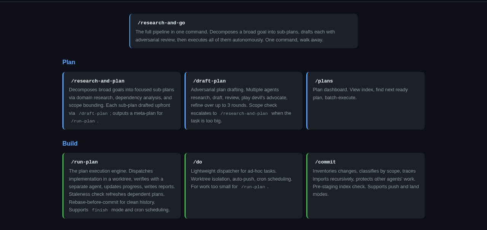
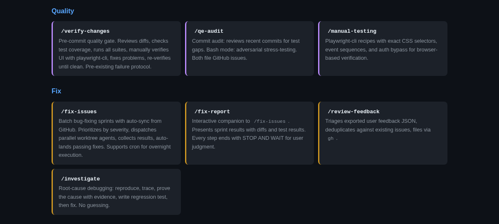
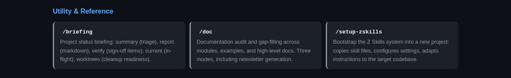
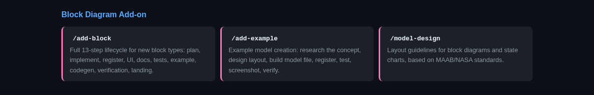

<!-- prod-strip:start -->
[](https://github.com/zeveck/zskills-dev/actions/workflows/ship-to-prod.yml)
[](https://github.com/zeveck/zskills-dev/actions/workflows/test.yml)

> ⚠️ **This is `zskills-dev`, the development repository.** End users should
> install from the public mirror at **[`github.com/zeveck/zskills`](https://github.com/zeveck/zskills)**.
> Content here is pre-release and may include experimental skills, canary
> plans, and in-progress work. The release workflow above strips dev-only
> artifacts and publishes to prod — maintainers only.

---

<!-- prod-strip:end -->
# Z Skills

**20 skills that plan, build, test, fix, and ship** — so one developer
can run a full engineering team.

Z Skills encodes hard-won lessons from real agent failures into reusable
prompt files. Each skill is a `.claude/skills/<name>/SKILL.md` file that
teaches Claude Code how to drive a specific workflow with the discipline
that prevents the most common AI agent failure modes: skipping
verification, weakening tests, deferring hard parts, and shipping broken
code.

The philosophy is **plan-driven development**: a human writes (or drafts
with `/draft-plan`) a markdown plan, and `/run-plan` executes it phase by
phase inside an isolated git worktree, verifying each phase with a fresh
reviewer agent and landing the result to main (cherry-pick, PR, or
direct — your choice).

**[View the full presentation](https://zskills.synapticnoise.com/PRESENTATION.html)**
for the architecture, workflow stages, enforcement model, and war
stories.

## The Skills







## Quick Install

Tell your agent (copy-paste):

```
Install zskills from github.com/zeveck/zskills — see repo for directions
```

A capable agent will clone the repo, copy the skills into your
project, and run `/update-zskills` to complete setup. Full manual steps
are below if you prefer to drive it yourself.

This is **not** a pip/npm package — do not `pip install` or `npm install`
it. The repo contains prompt files and scripts that get copied into your
project.

### Steps

1. **Clone the repo** (if not already cloned):
   ```bash
   git clone https://github.com/zeveck/zskills.git /tmp/zskills
   ```

2. **Copy skills** from the clone into your project:
   ```bash
   mkdir -p .claude/skills
   cp -r /tmp/zskills/skills/* .claude/skills/
   ```

3. **Run `/update-zskills`** to complete setup. This is the important
   step — it creates `CLAUDE.md` with auto-detected project settings,
   installs hooks and scripts, registers hooks in `settings.json`,
   writes `.claude/zskills-config.json`, verifies dependencies, and
   reports any gaps. On a greenfield project it will ask you a single
   question: which landing mode you want (see below).

That's it. `/update-zskills` handles everything beyond the initial skill
copy.

### First-run choice: landing mode

On a fresh project `/update-zskills` will prompt:

```
How should /run-plan land changes?
  (1) cherry-pick — each phase squash-lands directly to main (simple, solo)
  (2) locked-main-pr — plans become feature branches + PRs, CI, auto-merge
      (locked main, shared repo)
  (3) direct — work on main, no worktree isolation (minimal, risky)
```

You can also pass the preset directly — no prompt — when you already know
what you want:

```
/update-zskills cherry-pick
/update-zskills locked-main-pr
/update-zskills direct
```

Running `/update-zskills <preset>` on an already-configured project
**rewrites only three fields** (`execution.landing`,
`execution.main_protected`, and the `BLOCK_MAIN_PUSH` toggle in the
safety hook). Every other config field is preserved. See
[Landing modes](#landing-modes) for what each preset does.

### Add-ons

To include the block-diagram add-on (3 extra skills):

```bash
/update-zskills install --with-block-diagram-addons
```

### Updating

Run `/update-zskills` anytime — it pulls the latest from the repo,
updates changed skills, and fills any new gaps. If you have a config
already, it will not re-prompt.

### Your first plan

Once installed:

```
/draft-plan Add a dark-mode toggle to the settings page.
/run-plan plans/<generated-file>.md
```

`/draft-plan` drafts a plan with adversarial review and writes it to
`plans/`. `/run-plan` reads that plan and executes it phase by phase
inside an isolated worktree, verifying each phase with a fresh reviewer
and landing results via your configured landing mode.

## Landing modes

Three modes control how agent work reaches `main`. The columns below
reference three install-time knobs:

- **`execution.landing`** — which strategy `/run-plan` uses
  (cherry-pick, PR, or direct commit).
- **`execution.main_protected`** — when `true`, the project-level hook
  blocks agent commits, cherry-picks, and pushes on `main`.
- **`BLOCK_MAIN_PUSH`** — a one-line toggle in
  `.claude/hooks/block-unsafe-generic.sh` that blocks `git push main`
  at the generic layer. Belt-and-suspenders with `main_protected`.

| Preset | `execution.landing` | `execution.main_protected` | `BLOCK_MAIN_PUSH` | Use when |
|---|---|---|---|---|
| `cherry-pick` (default) | `cherry-pick` | `false` | `0` | Solo dev, local main, no CI gate |
| `locked-main-pr` | `pr` | `true` | `1` | Shared repo, PR workflow, branch protection / CI required |
| `direct` | `direct` | `false` | `0` | Prototypes, single-developer throwaway work |

- **cherry-pick** — Each phase runs in an auto-named worktree. When it
  passes verification, its squashed commit is cherry-picked to `main`
  in the main repo. Fast, linear history, no PRs. Default.
- **locked-main-pr** — Each plan gets a named feature branch in a
  worktree. When all phases pass, the branch is pushed, a PR is
  created, CI runs, and (if `ci.auto_fix=true`) the agent watches for
  CI failures and pushes fix commits until CI is green, then auto-merges.
  The hook blocks any agent attempt to push to `main` directly.
- **direct** — Work happens on `main` itself, no worktree isolation.
  Minimal overhead, no review gate. Don't pick this for anything
  important.

You can override the config default on a single invocation:

```
/run-plan plans/X.md finish auto pr
/fix-issues 10 pr
/do Add dark mode. pr
```

## Config file

`.claude/zskills-config.json` is the single source of truth. Full schema
at [`config/zskills-config.schema.json`](config/zskills-config.schema.json).

```json
{
  "$schema": "./zskills-config.schema.json",
  "project_name": "my-app",
  "timezone": "America/New_York",
  "execution": {
    "landing": "cherry-pick",
    "main_protected": false,
    "branch_prefix": "feat/"
  },
  "testing": {
    "unit_cmd": "npm test",
    "full_cmd": "npm run test:all",
    "output_file": ".test-results.txt",
    "file_patterns": ["tests/**/*.test.js"]
  },
  "dev_server": {
    "cmd": "npm start",
    "main_repo_path": "/home/you/projects/my-app"
  },
  "ui": {
    "file_patterns": "src/(components|ui)/.*\\.tsx?$",
    "auth_bypass": "localStorage.setItem('token', 'test')"
  },
  "ci": {
    "auto_fix": true,
    "max_fix_attempts": 2
  },
  "agents": {
    "min_model": "auto"
  }
}
```

Key fields:

- **`execution.landing`** — `cherry-pick` | `pr` | `direct`. Preset-owned.
- **`execution.main_protected`** — When `true`, skills refuse to commit,
  cherry-pick, or push to `main`. Preset-owned.
- **`execution.branch_prefix`** — Prefix for agent-created feature
  branches (e.g. `feat/`).
- **`testing.unit_cmd` / `testing.full_cmd`** — Test commands. Read by
  `/verify-changes`, `/run-plan`, the pre-commit hook, and others.
- **`testing.output_file`** — Where test output gets captured. Never
  pipe test output; always capture to this file.
- **`dev_server.cmd` / `main_repo_path`** — Lets
  worktree agents find the running dev server in the main repo.
  `main_repo_path` must be the absolute path to your repo's root
  (substitute your own — the example above is illustrative).
- **`ui.file_patterns`** — Regex identifying UI files. When these
  change, the pre-commit hook requires manual browser verification.
- **`ui.auth_bypass`** — JavaScript executed during
  `/manual-testing` to bypass login.
- **`ci.auto_fix`** — In PR mode, whether the agent polls CI and
  attempts to fix failures.
- **`ci.max_fix_attempts`** — Cap on fix-and-push cycles (default 2).
- **`agents.min_model`** — Minimum model for subagent dispatch.
  `auto` = "inherit from this session's model." Enforced by the
  `block-agents.sh` hook.

## Tracking scheme

Long-running pipelines (`/run-plan`, `/fix-issues`, `/research-and-go`)
declare what they're about to do and what they've finished via **tracking
markers** under `.zskills/tracking/`. Hooks consult these markers before
allowing `git commit`, `git cherry-pick`, and `git push`.

**Layout** (per-pipeline subdir, Option B):

```
.zskills/tracking/<PIPELINE_ID>/
  requires.<step>       # this step MUST run before commit
  fulfilled.<step>      # this step completed
  step.<phase>.<kind>   # intra-phase substep (implement / verify / ...)
  meta.*                # pipeline metadata
```

Per-pipeline subdirs let multiple `/run-plan` sessions run concurrently
on the same repo without marker collisions — **parallel pipelines are a
core use case**, not a nice-to-have.

See [`docs/tracking/TRACKING_NAMING.md`](docs/tracking/TRACKING_NAMING.md)
for the authoritative naming scheme, delegation semantics, and hook
enforcement rules.

Two other file types sit alongside tracking markers:

- **`.zskills-tracked`** (repo root of each pipeline's worktree and the
  main repo) — a single-line file containing the active pipeline ID. The
  orchestrator writes it before dispatching work, removes it after the
  pipeline completes. Hooks use it to scope marker matching.
- **`.landed`** (worktree root) — a YAML-ish marker written by
  `/commit land` (via the script bundled in the `commit` skill) when a
  worktree's work has been cherry-picked (or merged) to main. `status: full`
  = safe to remove the worktree. `status: partial` / `not-landed` = inspect
  first.

## Hook policies

Z Skills ships two PreToolUse hooks that block specific unsafe patterns:

### `block-unsafe-generic.sh` (project-independent)

- **Destructive git ops:** `git stash drop/clear`, `git checkout --`,
  `git restore`, `git clean -f`, `git reset --hard`.
- **Destructive FS ops with scope policy:** `rm -r/-rf`, `find -delete`,
  `rsync --delete`, `xargs rm -r`. The hook **permits** literal,
  contained `/tmp/<name>` paths (e.g. `rm -rf /tmp/zskills-tests/foo`)
  but **blocks** wide scope or variable expansion (`rm -rf "$DIR"`,
  `rm -rf ~`, anything with `*`/`?`/backticks/`$(...)`).
- **Process kills:** `kill -9`, `killall`, `pkill`, `fuser -k` — these
  can kill container-critical processes or other sessions' dev servers.
- **Discipline violations:** `git add .` / `git add -A`,
  `git commit --no-verify`.
- **Main-push block** (preset-controlled): when `BLOCK_MAIN_PUSH=1`
  (set by `locked-main-pr`), the hook blocks `git push` to `main` /
  `master`. Feature-branch pushes are always allowed.

### `block-unsafe-project.sh` (project-specific)

- **No-pipe-on-tests:** blocks piping test output
  (`<cmd> | tail`, `| grep`, etc.) — test runs must capture to
  `testing.output_file` so nothing is lost.
- **UI verification gate:** when changed files match
  `ui.file_patterns`, blocks commit until a recent browser verification
  marker exists.
- **Tracking enforcement:** blocks `git commit` / `git cherry-pick` /
  `git push` when a pipeline's `requires.*` markers haven't been
  fulfilled, or when a `step.*` chain is incomplete
  (implement-without-verify, verified-without-report).
- **`main_protected` access control:** when
  `execution.main_protected=true`, blocks agent commits, cherry-picks,
  and pushes on `main`.
- **Tracking directory protection:** blocks recursive deletion of
  `.zskills/tracking/`.
- **`clear-tracking.sh` exec block:** agents cannot run
  `.claude/skills/update-zskills/scripts/clear-tracking.sh` — only the user can clear tracking state
  (it's an escape hatch, not an agent routine).

Both hooks fail closed: when a rule fires, the agent sees a permission
denial and must take a different path, not route around it.

## Canary suite

The canary plans under [`plans/CANARY*.md`](plans) are real regression
scaffolds — each one is a plan that was executed end-to-end to validate
a specific behavior.

Runnable test scripts (always green):

- `tests/test-hooks.sh` — block-unsafe hook rules, preset toggle.
- `tests/test-canary-failures.sh` — fixtures that exercise known failure
  shapes (weakening tests, stubbing, skipping verification).
- `tests/test-tracking-integration.sh` — tracking marker enforcement
  end-to-end.
- `tests/test-scope-halt.sh` — scope violation halts pipeline.
- `tests/test-skill-invariants.sh` — structural invariants every
  SKILL.md must hold.
- `tests/e2e-parallel-pipelines.sh` (opt-in, `RUN_E2E=1`) — two concurrent
  `/run-plan` sessions on the same repo without marker collisions.

Manually-run canary plans (markdown plans under `plans/`):

| Canary | What it validates |
|---|---|
| `CANARY1_HAPPY` / `CANARY5_AUTONOMOUS` | Happy-path single-phase runs |
| `CANARY2_NOAUTO` | `pr-ready` fallback when auto-merge is unavailable |
| `CANARY3_FIXCYCLE` | CI failure → fix-agent → re-push → CI passes → auto-merge |
| `CANARY4_EXHAUST` | Fix-attempts exhaustion: `status: pr-ci-failing` reported cleanly |
| `CANARY6_MULTI_PR` | Sequential multi-PR landing in PR mode |
| `CANARY7_CHUNKED_FINISH` | `finish auto` chunking with cron-fired phases |
| `CANARY8_PARALLEL` + `PARALLEL_CANARYA/B` | Concurrent pipelines on one repo |
| `CANARY9_FINAL_VERIFY` | Cross-branch final-verify gate |
| `CANARY10_PR_MODE` | PR-mode landing, tracker bookkeeping in worktree |
| `CANARY11_SCOPE_VIOLATION` (+ `CANARY11_TEST_PLAN`) | Verifier catches scope-flag violations |
| `CANARY_FAILURE_INJECTION` | Built `tests/test-canary-failures.sh` — external-user shareability gate |
| `CHUNKED_CRON_CANARY` | Cron-fired chunked execution |
| `CI_FIX_CYCLE_CANARY` | PR CI fails → fix agent → re-push → auto-merge |
| `REBASE_CONFLICT_CANARY` | Two-session rebase conflict resolution |

### Run the full test suite

```bash
bash tests/run-all.sh                    # unit + integration, ~30s
RUN_E2E=1 bash tests/run-all.sh          # + e2e-parallel-pipelines
```

## Skill catalog

### 20 Core Skills (`skills/`)

These work on any software project — web app, CLI tool, API service, game,
data pipeline.

#### Plan

| Skill | Purpose |
|-------|---------|
| `/draft-plan` | Adversarial plan drafting: research, draft, devil's advocate review, refine until converged |
| `/refine-plan` | Refine in-progress plans: review remaining phases against completed work, generate Drift Log |
| `/research-and-plan` | Decompose broad goals into focused sub-plans with dependency ordering |
| `/research-and-go` | Full autonomous pipeline: decompose, plan, execute — one command, walk away |
| `/plans` | Plan dashboard: index, status tracking, priority ranking, batch execution |

#### Build

| Skill | Purpose |
|-------|---------|
| `/run-plan` | Phase-by-phase plan execution with worktree isolation, verification gates, and auto-landing |
| `/do` | Lightweight task dispatcher for ad-hoc work with optional worktree/push/scheduling |

#### Verify

| Skill | Purpose |
|-------|---------|
| `/verify-changes` | 7-phase verification: diff review, test coverage audit, test run, manual UI check, fix, re-verify |
| `/qe-audit` | Quality audit of recent commits — find test gaps, edge cases, file issues |
| `/investigate` | Root-cause debugging: reproduce, trace, prove the cause with evidence, regression test, fix |

#### Fix

| Skill | Purpose |
|-------|---------|
| `/fix-issues` | Batch bug-fixing sprints: prioritize N issues, dispatch parallel agents, verify, land |
| `/fix-report` | Interactive sprint review — walk through results, gate landing on user approval |
| `/review-feedback` | Triage user feedback into GitHub issues: deduplicate, evaluate, file |

#### Ship

| Skill | Purpose |
|-------|---------|
| `/commit` | Safe commit: scope classification, import tracing, fresh review agent, dependency verification |
| `/quickfix` | Low-ceremony PR from main: picks up in-flight edits (or agent-dispatches), no worktree, fire-and-forget CI |
| `/cleanup-merged` | Post-PR-merge normalization: fetch+prune, checkout main, pull, delete local feature branches whose PRs have merged |
| `/briefing` | Project status dashboard: recent commits, worktree status, pending sign-offs |

#### Support

| Skill | Purpose |
|-------|---------|
| `/doc` | Documentation audit, gap-filling, and changelog/newsletter entries |
| `/manual-testing` | Playwright-cli recipes: real mouse/keyboard events, not eval — test as a user would |
| `/create-worktree` | Unified worktree creation (used by other skills and ad-hoc): prefix-derived path, safe branch-add with TOCTOU remap |
| `/update-zskills` | Install or update Z Skills infrastructure in any project |

### Block Diagram Add-on (`block-diagram/`)

3 additional skills for block-diagram editors. Not part of the core 20 —
install if your project involves visual block diagrams.
See [`block-diagram/README.md`](block-diagram/README.md).



## What Gets Installed

### 13 CLAUDE.md Rules

Agent guardrails that prevent the most common failure modes:

1. **Never weaken tests** — fix the code, not the test
2. **Capture test output to file** — never pipe through grep/tail
3. **Max 2 fix attempts** — stop and report, don't thrash
4. **Pre-existing failure protocol** — verify with git log, skip + file issue
5. **Never discard others' changes** — ask before touching uncommitted work
6. **Protect untracked files** — `git stash -u`, not `git stash`
7. **Feature-complete commits** — trace imports, verify before staging
8. **Always write `.landed` marker** — so worktrees can be safely cleaned up
9. **Verify worktrees before removing** — never batch-remove
10. **Never defer hard parts** — finish the plan, don't stop after the easy phase
11. **Correctness over speed** — follow instructions exactly, never stub
12. **Enumerate before guessing** — ls/grep first, build from scratch second
13. **Never skip pre-commit hooks** — fix the issue, don't bypass with --no-verify

### Helper Scripts

- `test-all.sh` — meta test runner (unit + E2E + build tests)
- `stop-dev.sh` — stop the dev server (consumer-customizable)

Skill machinery scripts moved into their owning skills under `.claude/skills/<owner>/scripts/` — see the `update-zskills` skill's `references/script-ownership.md` for the full table.

### Session Logging

Hooks that convert Claude Code JSONL transcripts to readable markdown
after every session and subagent run. Logs go to `.claude/logs/`.
Session logging is provided by a separate package:
[cc-session-logger](https://github.com/zeveck/cc-session-logger).

## Extending Z Skills

Add your own skills by creating `.claude/skills/<name>/SKILL.md` files.
A skill is just a markdown file with YAML frontmatter:

```yaml
---
name: my-skill
description: What this skill does (used for discovery)
disable-model-invocation: true  # only user can invoke
---

# /my-skill — Title

Instructions for the agent...
```

See any skill in `skills/` for the full pattern.

## License

MIT
