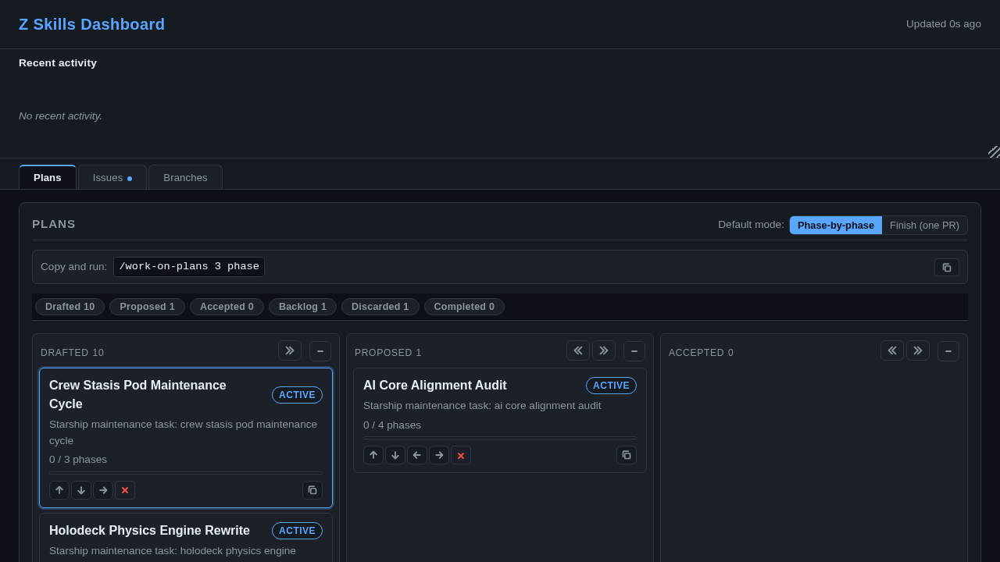

# Inspecting & Monitoring a zskills Project

> **Audience:** anyone driving or watching a zskills-managed repo who wants to
> answer *"what is the system doing, what has it done, and what's stuck?"* —
> without reading git history by hand.
>
> **Scope:** this guide covers the views and files you read to *observe* a
> project. For how hooks gate commits, see
> [`tracking-overview.md`](tracking-overview.md); for the marker naming scheme
> see [`docs/tracking/TRACKING_NAMING.md`](../tracking/TRACKING_NAMING.md).

## You don't need an agent to watch zskills

Everything zskills records is a **plain-text file or a web page you can read
directly**. The skills and hooks below are conveniences over that data — they
don't own it. Two things follow from that:

- **The dashboard is for you.** `/zskills-dashboard` serves a normal web UI in
  your browser — open it and click around; you don't need Claude in the loop to
  read plans, issues, worktrees, and tracking activity.
- **The tracking files are a trail you can read.** Every claim, step, and
  completion marker is a small text file under `.zskills/`. You can check what
  a pipeline actually did, phase by phase, with `ls`, `cat`, and `grep`. The
  hooks read the same files to decide whether a commit is allowed; nothing
  stops you from reading them too.

## The mental model: live state vs. durable record

zskills leaves two kinds of trail, and most confusion comes from mixing them
up:

| | **Live state** (what's happening *now*) | **Durable record** (what *happened*) |
|---|---|---|
| **Where** | `.zskills/claims/`, `current_phase` chips, crons, `.landed` | `fulfilled.*` markers, plan reports, git history |
| **Lifetime** | exists only while a pipeline is in flight; released or removed when it finishes | persists across runs; survives cleanup |
| **Answers** | "is anything running? is it stuck?" | "what has this project shipped, by which skill, when?" |
| **Read it with** | `/briefing`, the dashboard, `ls .zskills/claims` | `fulfilled.*` files, `/session-report`, `docs/reports/` |

Everything below is one of these two views.

---

## 1. The four inspection skills

These are the high-level, friendly views. Reach for these first; drop to the
raw files (sections 2–4) when you want to confirm them or dig deeper.

| Skill | Shows | Reach for it when |
|-------|-------|-------------------|
| `/briefing` | worktree status, open checkboxes, recent commits | "where does the project stand right now?" |
| `/plans` | every plan's status + the next ready plan | "what plan should run next / what's blocked?" |
| `/zskills-dashboard` | local web UI: plans, issues, worktrees, branches, tracking activity, a drag-and-drop priority queue | you want a live, clickable overview |
| `/session-report` | what **this session** said it would do vs. what actually shipped (checked against git/PRs/plans, not memory) | "did I actually land everything I claimed this session?" |

### `/briefing` — project status, with modes and a time window

The default at-a-glance view: recent commits, open checkboxes, worktree state.
It takes a mode, and `report` takes a time window:

```text
/briefing                # summary (default)
/briefing report 24h     # fuller report over a window (1h|6h|24h|2d|7d)
/briefing verify         # check that recent changes hold up
/briefing current        # what's in flight
/briefing worktrees      # worktree inventory
/briefing every 6h       # run a recurring briefing (stop / next manage it)
```

### `/plans` — the plan queue

The in-terminal plan view: every plan's status and **the next ready plan to
run** (dependencies satisfied, not blocked, not already in flight). This is the
"what should happen next?" view; the dashboard (below) is its clickable web
equivalent.

```text
/plans            # status of every plan + the next ready one
/plans details    # one line per plan
/plans next       # just the next ready plan
/plans rebuild    # regenerate the plan index
```

`/plans` is read-only — it shows status and tells you what's next, but doesn't
start anything. To actually run the ready plans, `/work-on-plans` takes the
prioritized queue (the same order you set by dragging in the dashboard) and
runs `/run-plan` for each. By default it opens one PR per plan; add the `phase`
token to run one phase at a time instead.

### `/zskills-dashboard` — the browser view

Starts a local web server in the background and opens a page that reads the
project's live state:

```text
/zskills-dashboard start | stop | status | restart
```

The `start` command prints the URL — open it in your browser to see plans,
issues, worktrees, branches, tracking activity, and a drag-and-drop priority
queue. `restart` is stop-then-start (use it after you change the dashboard's
own code). Leave it running and refresh the page to watch a pipeline progress
without asking the agent anything.



> **Try it live:** an interactive, browser-only demo of this dashboard runs at
> **<https://zeveck.github.io/zskills-dev/dashboard-demo/>** — drop plans into *Accepted*
> (and issues into *Ready*) and watch them get worked, with the activity feed
> and run-status chips updating live. *(The screenshot above is from that demo;
> its plan names are illustrative placeholders.)*

### `/session-report` — the honesty check

Reconciles what **this session** *said* it would do against what actually
shipped — checked against git, PRs, plans, and worktrees, not conversation
memory. It takes no arguments; run it at the end of a working session. It
catches the two things memory gets wrong: "I thought I shipped X but the PR
never merged," and "I did finish Y — in another session." Run it before you
trust a session's own summary of itself.

---

## 2. Tracking markers as a record of what happened

`.zskills/tracking/<pipeline-id>/` holds the markers the hooks use to gate
commits (`requires.*`, `step.*`) **and** the durable completion records
(`fulfilled.*`). The record you'll care about is the `fulfilled.*` set — these
are plain files you can read to confirm any claim a skill makes.

### The marker families

| Family | Role | Lifetime |
|--------|------|----------|
| `requires.<skill>.<id>` | a declared obligation ("this skill must run before landing") | temporary — cleared on cleanup |
| `step.<skill>.<id>.<stage>` | progress within a pipeline (`implement` / `verify` / `report` / `land`) | temporary |
| `fulfilled.<skill>.<id>` | **a completion record** — one per invocation that landed work | **durable** — kept on cleanup |

Cleanup is built around exactly this split: it **keeps** the `fulfilled.*`
completion records for the skills that land work (`/run-plan`, `/land-pr`,
`/commit`, `/do`, `/fix-issues`) and clears everything else (the
in-flight scaffolding). So after cleanup, the tracking directory *is* your
completion history.

### What a completion record contains

```text
# fulfilled.run-plan.<plan-slug>
skill: run-plan
id: claim-work-item
plan: docs/plans/claim-work-item.md
phase: 4
status: complete
date: 2026-05-30T01:14:24-04:00

# fulfilled.land-pr.<id>
skill: land-pr
id: claim-work-item
pr: https://github.com/<org>/<repo>/pull/825
branch: feat/claim-work-item
date: 2026-05-30T01:14:23-04:00
```

That's enough to answer "which plan, which phase, landed via which PR, when" —
no digging through git required.

### Reading a pipeline's steps by hand

You can reconstruct what a pipeline did, in order, without invoking anything.
The `step.*` files are the per-stage breadcrumbs (present until cleanup sweeps
them); the `fulfilled.*` records are the final word:

```bash
T=.zskills/tracking

# Walk one pipeline's steps in order (implement → verify → report → land):
ls -1 "$T"/run-plan.<plan-slug>/step.* 2>/dev/null
cat   "$T"/run-plan.<plan-slug>/step.run-plan.<plan-slug>.verify   # shows result: pass

# Confirm it actually completed and landed:
cat "$T"/run-plan.<plan-slug>/fulfilled.run-plan.<plan-slug>      # status: complete
cat "$T"/run-plan.<plan-slug>/fulfilled.land-pr.<plan-slug>       # pr + date
```

### Counting what shipped

The `fulfilled.*` files double as a tally. To see how much a project has
landed, count them by skill:

```bash
T=.zskills/tracking

find "$T" -name 'fulfilled.run-plan.*'    | wc -l   # plans completed
find "$T" -name 'fulfilled.land-pr.*'     | wc -l   # PRs landed
find "$T" -name 'fulfilled.fix-issues.*'  | wc -l   # issues resolved

# Plans that actually reached "complete" (not just started):
grep -rl 'status: complete' "$T"/*/fulfilled.run-plan.* | wc -l
```

If you ever want to find a pipeline that started but never finished, look for a
`requires.*` file with no matching `fulfilled.*` in the same directory — that's
work that was declared but never completed. (When the hooks see the same thing,
they turn it into a commit/push block; `tracking-overview.md` covers that.)

---

## 3. Claims — what's running *right now*

A pipeline claims a work item before working on it (an issue **or** a plan) so
two pipelines never double-work the same thing. The claim is the single best
signal of "is something in flight?"

```bash
# What is in flight this moment:
ls -d .zskills/claims/*/                       # plan-<slug>/ and issue-<N>/ dirs
cat .zskills/claims/plan-<slug>/claim.json     # pipeline_id, current_phase, started_at
```

A claim's `current_phase` field is the live progress pointer. It starts at
`"Phase 0 — acquired"` and advances to `"Phase 1"`, `"Phase 2"`, and so on as
the run moves through the plan — `cat` it again later to see where it's up to. A
claim is taken when work starts and released when the work resolves; there is
no timeout, so a claim left behind after a crash is the accepted cost of never
killing a long-running agent mid-work. A pipeline re-taking its **own** claim
succeeds — that's not a collision. To clear a genuinely stale claim by hand:

```bash
bash skills/run-plan/scripts/claim-plan.sh release <slug> --require-pipeline <pid>
# issues: skills/fix-issues/scripts/claim-issue.sh release <N> --require-pipeline <pid>
```

---

## 4. `.landed` — per-worktree landing state

When a pipeline lands work it writes a `.landed` file in the worktree. It is
**not** a tracking marker — it records worktree state, and it's the fastest way
to tell whether a leftover worktree is safe to remove.

```bash
cat <worktree>/.landed
```

| `status:` | meaning |
|-----------|---------|
| `landed` | merged or cherry-picked to main — safe to remove |
| `pr-ready` | PR open, CI green, awaiting review |
| `pr-ci-failing` | PR open, CI failing after fix attempts |
| `conflict` / `pr-failed` | needs manual intervention |
| `not-landed` | agent finished without landing |

If a worktree has no `.landed`, check it manually before removing
(`git log main..<branch>`, `git status`). See the Worktree Rules in
`CLAUDE.md`.

---

## 5. Plan reports — the readable narrative

For prose detail (per-phase work items, verification results, sign-off items),
read the generated reports rather than the markers:

```text
docs/reports/plan-<slug>.md   # per-plan, newest phase at the top
docs/reports/SPRINT_REPORT.md # /fix-issues sprint outcomes
<audit-dir>/PLAN_REPORT.md    # index across all plan reports
```

(Report paths come from your config's `output.reports_dir`; this project uses
`docs/reports/`.) Each `/run-plan` phase adds a section at the top with status,
commit, work-item table, and verification tally — so the report reads as a
phase-by-phase history in plain English, alongside the machine markers in
section 2.

---

## 6. Watching a *running* pipeline

A long `finish auto` run leaves several live signals you can watch — refresh
the dashboard, or `cat` the files:

- **Claim `current_phase`** — `cat .zskills/claims/plan-<slug>/claim.json`
  updates as the run moves from one phase to the next.
- **Dashboard activity** — `/zskills-dashboard` shows tracking activity and a
  run-status chip (queued / phase-N / finish / locked).
- **The cron itself** — a `finish auto` run schedules a recurring cron;
  `/run-plan <plan> status` shows phase progress, `/run-plan <plan> next` shows
  the next fire, and `/run-plan stop` cancels it (and releases the claims the
  run was holding).

---

## 7. Session logs — an opt-in transcript trail

zskills can write a per-session log — what the agent did, plus every permission
request — to disk **once you turn it on**, turning "what happened across
sessions" into something you can read after the fact. Two config keys control it
(see [Configuring zskills](zskills-config.md)):

- `logging.enabled` (**default `false`** — opt-in) — the master switch; set it
  `true` to turn session logging on. When off or absent, both hooks no-op.
- `logging.dir` — the **base** directory. Left empty it goes to a per-OS cache
  base (e.g. `~/.cache/zskills-session-logs` on Linux). The base is then composed
  with the optional `<repo>`/`<user>` segments, and the hook records the final
  path in the **main checkout's** `.zskills/session-log-dirs` (newest last — one
  registry shared by all the repo's worktrees) so you can always find where it
  logged. Point it at a stable **absolute** path to keep a durable trail you can
  `cat` later.
- `logging.include_repo` (default `true`) / `logging.include_user` (default
  `false`) — compose the final path as
  `<base>/[<repo>]/[<user>]/<session>.md`. `<repo>` is the project basename;
  `<user>` is resolved at runtime (`ZSKILLS_LOG_USER` > `git config user.email`
  > OS login > `unknown`). With the defaults the path is byte-identical to a
  single per-project directory.
- `logging.file_mode` (default `"0600"`, POSIX-only) — the octal mode for log
  files + sidecars (dir mode is derived: `0660→0770`, `0640→0750`, `0600→0700`).

Because it captures the permission requests too, this is a useful monitoring and
audit record for unattended (`auto` / scheduled) runs — turn it on
(`logging.enabled: true`) and point `logging.dir` somewhere persistent before you
walk away.

**Shared mount (NFS/SMB).** To collect logs from multiple developers + repos
into one mount, set `logging.dir` to the share, `include_repo: true`,
`include_user: true`, and relax `file_mode` (e.g. `"0660"`) so an authorized
group can read/write:

- **POSIX**: zskills sets mode bits only — the admin owns group ownership +
  inheritance: `chgrp -R <group> <dir> && chmod -R g+rws <dir>` (the setgid `s`
  makes new files inherit the group). Relaxing `file_mode` exposes logs (which
  may contain `cat`-ed credentials) to the group, so opt in deliberately.
- **Windows/SMB**: `file_mode` is a no-op; access is governed by the share's
  NTFS/SMB ACLs the admin sets. The `<repo>`/`<user>` composition still applies.

---

## 8. Cheat sheet

```bash
# --- live: what's running now ---
ls -d .zskills/claims/*/                                  # in-flight claims
git worktree list                                          # active worktrees
for w in $(git worktree list --porcelain | awk '/^worktree /{print $2}'); do
  [ -f "$w/.landed" ] && echo "$w: $(grep '^status:' "$w/.landed")"
done                                                       # landing state per worktree

# --- durable: what happened ---
find .zskills/tracking -name 'fulfilled.*' | wc -l         # total completion records
grep -rl 'status: complete' .zskills/tracking/*/fulfilled.run-plan.*   # plans completed
ls docs/reports/plan-*.md                                  # per-plan narratives

# --- high-level views ---
/briefing                # project status
/plans                   # plan dashboard
/zskills-dashboard start # web UI (then open the printed URL in a browser)
/session-report          # this-session check
```

**Housekeeping:** `bash skills/update-zskills/scripts/clear-tracking.sh` sweeps
the temporary `requires.*` / `step.*` files and **keeps the `fulfilled.*`
completion records** — run it when the marker count grows large; your history
is never touched.

---

## See also

- [`tracking-overview.md`](tracking-overview.md) — how markers gate commits,
  with worked examples and a troubleshooting section.
- [`docs/tracking/TRACKING_NAMING.md`](../tracking/TRACKING_NAMING.md) — the
  marker naming scheme, delegation semantics, and `.landed` semantics.
- [`docs/guides/workflows.md`](workflows.md) — end-to-end workflows (§11 is the
  short Status & monitoring index this guide expands on).
